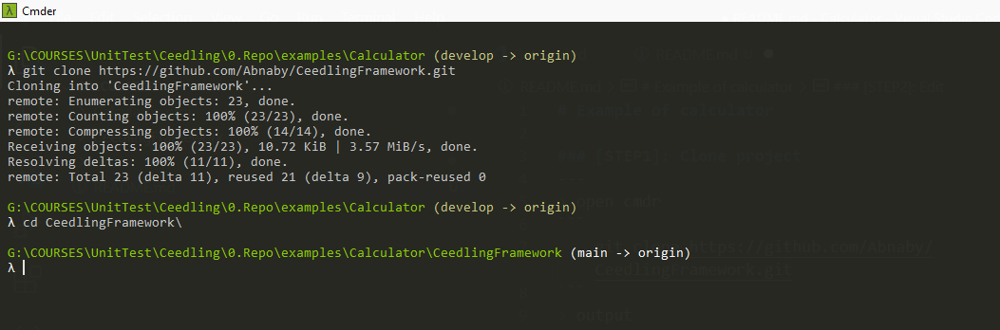
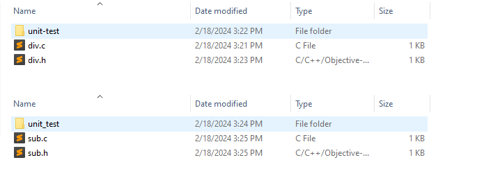
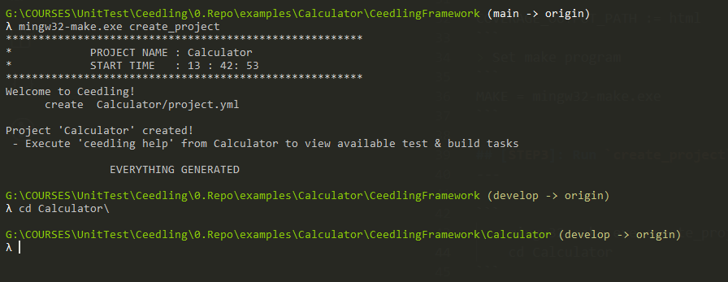
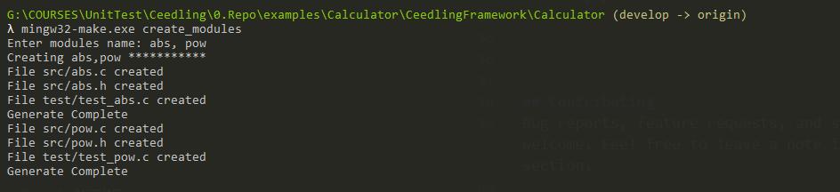
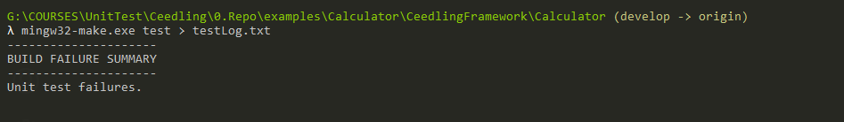
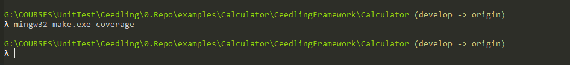
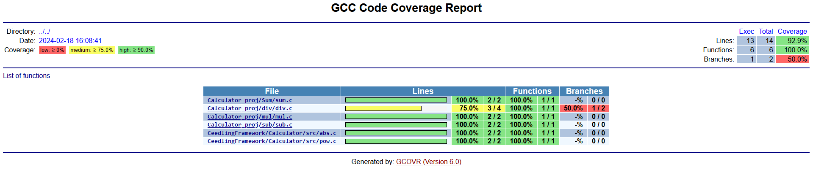

# Example of calculator 

## [STEP1]: Clone project
--- 
> open cmdr 
```
    git clone https://github.com/Abnaby/CeedlingFramework.git
```
> output 



## [STEP2]: Edit `Makefile` parameters 

> Add project name and src file directory 
```
PROJ_NAME = Calculator
PROJ_DIR := G:/COURSES/UnitTest/Ceedling/0.Repo/examples/Calculator/Calculator_proj
```
> for UNIT_TEST_POSS_SUFFIXES 

```
UNIT_TEST_POSS_SUFFIXES := unit_test unit-test
```
because of in written unit tests in folders named `unit_test` and `unit-test`


> for Coverage path

for V1.0 keep it without editing 
```
COVERAGE_OUTPUT_PATH := html
```
> Set make program 
```
MAKE = mingw32-make.exe
```

## [STEP3]: Run `create_project` rule
---

```
    mingw32-make.exe create_project
    cd Calculator
```
> output 



## [STEP4]: Create module -Optional-
```
mingw32-make.exe create_modules 
    abs, pow
```

Don't Forget to implement these functions.

## [STEP5]: Run written test cases 
```
 mingw32-make.exe test
```
Will find output in terminal but if you want to add it in log file 
```
 mingw32-make.exe test > testLog.txt
```



## [STEP6]: Generate coverage reports -Optional-
```
 mingw32-make.exe coverage
```

> output 


> Coverage Report 

```
G:\COURSES\UnitTest\Ceedling\0.Repo\examples\Calculator\CeedlingFramework\Calculator\html
```


[MAY_HAPPEN] html folder empty 
> run 
```
ceedling gcov:all
```
## Contributing  
Bug reports, feature requests, and so on are always welcome. Feel free to leave a note in the Issues section.
